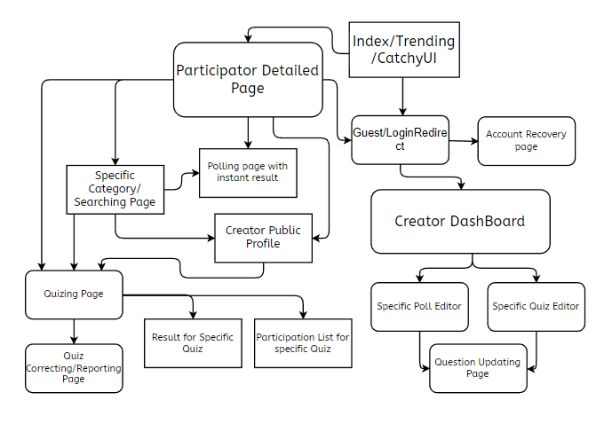

# azquiz
Well an app for quiz and polls.

### Web Pages
1. Index/Trending/CatchyUI [Guest allowed]
2. Guest/LoginRedirect
3. Participator Detailed Page [Guest allowed]
4. Creator DashBoard -> List of Quizes and polls
5. Specific Quiz Editor
6. Specific Poll Editor
7. Question Updating Page 
8. Specific Catagory/Searching List
9. Quizing Page [Guest allowed]
10. Quizing Correcting/Reporting Page 
11. Polling Page with Instant Result [Guest allowed]
12. Result for the specific Quiz 
13. Participation List for quiz
14. Account Recovery Page

## Page Flow Layout

### For Setup (Use only Once)
- Enviroment Set Page
- Database Connection

## Catagories
1. Animals
1. Animanga
1. Aptitude
1. Automobile
1. Beauty and Fashion
1. CS and Programming
1. Crypto and Misterious Web
1. Current Affairs
1. Finance
1. Fitness and Sports
1. Games
1. Geography
1. History
1. Movies and TV shows
1. Music
1. Tech
1. Science

### Database
1. Account Table
    - Account no
    - User ID
    - Name 
    - Email
    - HashPass
2. Quiz Listing
    - Quiz List
    - Quiz Id
    - User Id
    - Quiz Name
    - Time 
    - Catagories
3. 2 option Quiz 
    - Quiz Id 
    - Question
    - Picture Path [optional]
    - Option 1
    - Option 2
    - Answer 
4. 3 option Quiz 
    - Quiz Id 
    - Question
    - Picture Path [optional]
    - Option 1
    - Option 2
    - Option 3
    - Answer 
5. 4 option Quiz 
    - Quiz Id 
    - Question
    - Picture Path [optional]
    - Option 1
    - Option 2
    - Option 3
    - Option 4
    - Answer 
6. Quiz Participation List
    - Quiz Id
    - User Id / Guest Id
    - Name [UserName if logined]
    - Time 
    - Score
7. Poll List + Participation Ratios
    - Poll Id
    - User Id
    - Poll Name
    - Question 
    - Picture Path [optional]
    - Option 1
    - Option 2
    - COunt for Option 1
    - Count for Option 2
 
| Syntax | Description |
| ----------- | ----------- |
| Header | Title |
| Paragraph | Text |